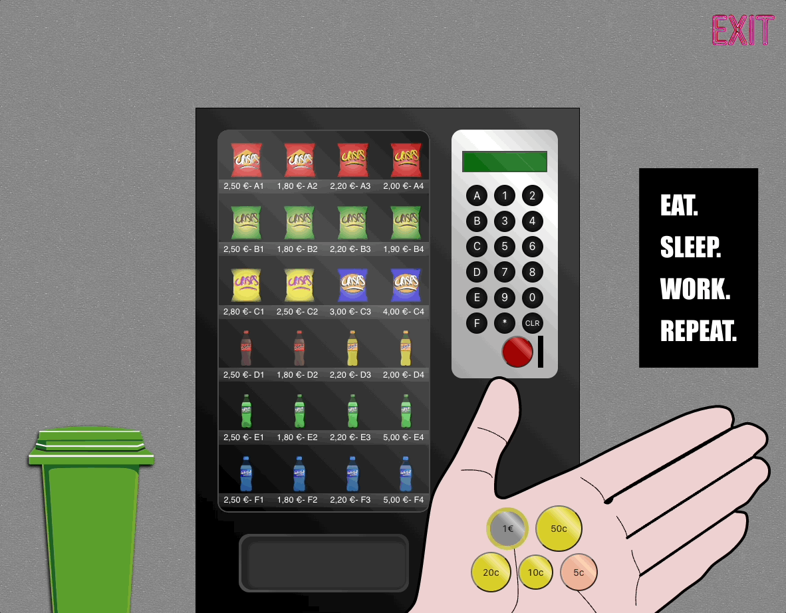
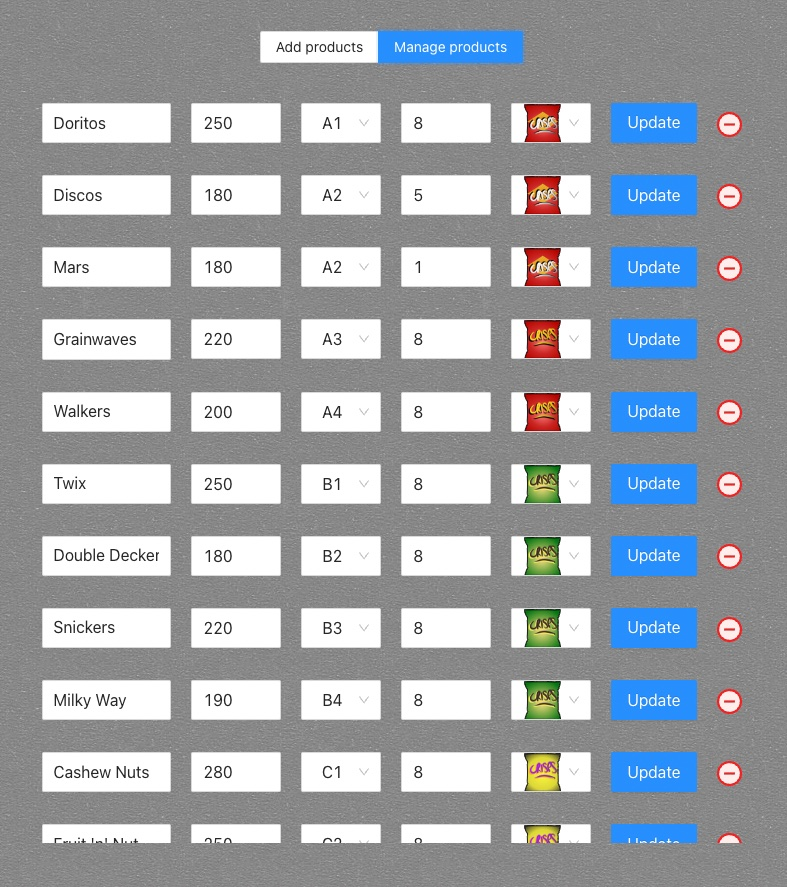

# Vending machine

### Insights

Buyer page

   

Seller page

   

   

### Technologies

#### Frontend
* [React](https://reactjs.org/)
* [Ant Design System](https://ant.design/components/overview/)
* [Vite App boilerplate](https://vitejs.dev/)
* [Sass CSS preprocessor](https://sass-lang.com/)

#### Backend
* [Node.js](https://nodejs.org/en/)
* [NestJS framework](https://nestjs.com/)
* [MongoDB](https://docs.nestjs.com/techniques/mongodb)

   

   

## Setup & Run

### Prerequisites:
Client & server
- NodeJS version: 16 (not supported: 17)
- Web browser: Chrome, Mozilla Firefox

   

   

### Installation

#### React & Nodejs
To install the dependencies for both `/frontend` & `/backend` folders followed by database initialization 

### Run

#### Server

`cd backend/`  

`docker-compose up -d`  

`npm run start:dev`  

#### Client

`cd frontend/`  

`npm run dev`

   

   
